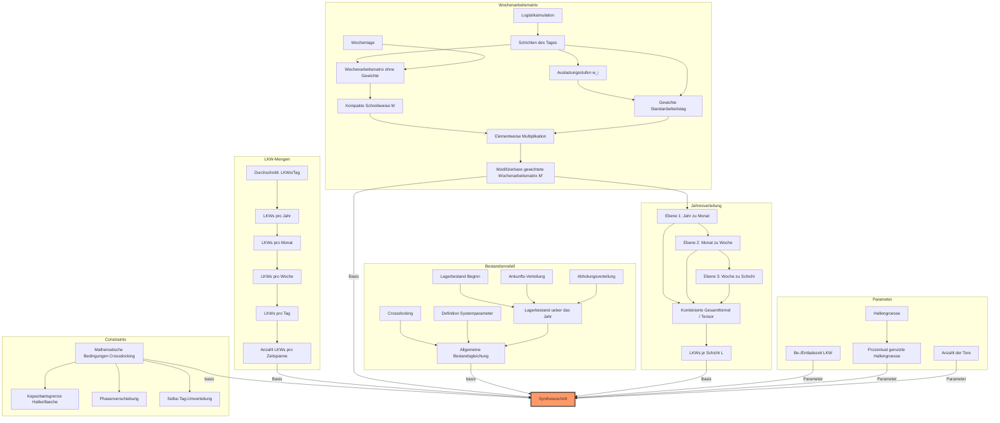

# Syntheseschritt: Crossdocking-Center Simulation

## 1. Ueberblick

Der Syntheseschritt fuehrt alle Teilmodelle des Wissensgraphen zu einem Gesamtentwurf zusammen. Ziel ist ein Python-Programm, das **Anlieferung**, **Lagerbestand** und **Abholung** eines Crossdocking-Centers abbildet auf Basis der:

- Gewichteten Wochenarbeitsmatrix
- Wochen- und Jahresverteilung (Saisonalitaet)
- Anzahl der Tore
- Be-/Entladungszeiten je LKW
- Hallengroesse und prozentualer Umschlagsflaeche

---

## 2. Eingabeparameter

### 2.1 Physische Parameter

| Parameter | Symbol | Beschreibung |
|-----------|--------|-------------|
| Anzahl der Tore | $G$ | Tore die fuer Be- und Entladung genutzt werden |
| Be-/Entladezeit LKW | $t_{BE}$ | Festgesetzte Dauer einer LKW Be- und Entladung |
| Hallengroesse | $H = L \times B$ | Groesse der Halle (Laenge x Breite) |
| Prozentuale Umschlagsflaeche | $\alpha$ | Prozentualer Anteil der Halle, der fuer Logistik genutzt wird |
| Kapazitaet der Hallenflaeche | $C_{Flaeche} = \alpha \cdot H$ | Maximale Stellplatzkapazitaet |

### 2.2 Zeitstruktur

**Schichten des Tages** - Unterteilung des Logistiktages in 5 gleiche Zeitspannen:

| Index | Schicht | Auslastungsstufe |
|-------|---------|-----------------|
| $s_1$ | Morgen | $w_1$ (Keine = 1) |
| $s_2$ | Mittag | $w_2$ (niedrig = 2) |
| $s_3$ | Nachmittag | $w_3$ (Mittel = 3) |
| $s_4$ | Abends | $w_4$ (Hoch = 4) |
| $s_5$ | Nachts | $w_5$ (sehr Hoch = 5) |

**Wochentage:** Vektor $d \in \{0,1\}^7$ bestimmt, an welchen Tagen gearbeitet wird (Mo-So).

### 2.3 Wochenarbeitsmatrix

**Binaere Basismatrix** (7 Tage x 5 Schichten):

$$M = \begin{pmatrix} m_{1,1} & m_{1,2} & m_{1,3} & m_{1,4} & m_{1,5} \\ m_{2,1} & m_{2,2} & m_{2,3} & m_{2,4} & m_{2,5} \\ \vdots & \vdots & \vdots & \vdots & \vdots \\ m_{7,1} & m_{7,2} & m_{7,3} & m_{7,4} & m_{7,5} \end{pmatrix} \in \{0,1\}^{7 \times 5}$$

**Gewichtsvektor des Standardarbeitstages:**

$$s = \begin{pmatrix} w_1 & w_2 & w_3 & w_4 & w_5 \end{pmatrix} \in \mathbb{R}^5$$

**Gewichtete Wochenarbeitsmatrix** (elementweise Multiplikation):

$$M' = M \circ \begin{pmatrix} w_1 \\ w_2 \\ \vdots \\ w_5 \end{pmatrix} = \begin{pmatrix} m_{1,1} \cdot w_1 & m_{1,2} \cdot w_2 & \cdots & m_{1,5} \cdot w_5 \\ m_{2,1} \cdot w_1 & m_{2,2} \cdot w_2 & \cdots & m_{2,5} \cdot w_5 \\ \vdots & \vdots & \ddots & \vdots \\ m_{7,1} \cdot w_1 & m_{7,2} \cdot w_2 & \cdots & m_{7,5} \cdot w_5 \end{pmatrix}$$

Die resultierende Matrix $M' \in \mathbb{R}^{7 \times 5}$ gibt die gewichtete Auslastung fuer jede Schicht $j$ an jedem Wochentag $i$ an. Die Gewichtung kann manuell in einem DataGridView angepasst werden.

### 2.4 Systemparameter der Bestandsrechnung

| Parameter | Symbol | Beschreibung |
|-----------|--------|-------------|
| Lagerbestand Beginn | $I_0$ | Anfaenglicher Lagerbestand der Halle |
| Ankunft von Ware | $A(t,s)$ | Anlieferung an Tag $t$ in Schicht $s$ |
| Abholung von Ware | $D(t,s)$ | Abtransport an Tag $t$ in Schicht $s$ |
| Lagerbestand | $I(t,s)$ | Aktueller Bestand am Tag $t$ nach Schicht $s$ |

---

## 3. Berechnungsmodell

### 3.1 Hierarchische LKW-Verteilung (Tensor-Modell)

Die LKW-Verteilung erfolgt ueber drei gestapelte Ebenen:

**Ebene 1: Jahr zu Monat (Saisonalitaet)**

$$N_{Monat, m} = N_{Jahr} \cdot \frac{v_m}{V_{Jahr}}, \quad V_{Jahr} = \sum_{k=1}^{12} v_k$$

- $N_{Jahr}$: Gesamtzahl der LKWs im Jahr
- $v_m$: Monatsgewicht (z.B. Januar = 1, Dezember = 3)

**Ebene 2: Monat zu Woche**

$$N_{Woche, w} = N_{Monat, m} \cdot \frac{u_w}{U_{Monat, m}}, \quad U_{Monat, m} = \sum u_w$$

- $u_w$: Wochengewicht innerhalb des Monats

**Ebene 3: Woche zu Schicht (Gewichtete Wochenarbeitsmatrix)**

$$l_{j,i} = N_{Woche, w} \cdot \frac{m_{w, j, i}}{W_{Woche, w}}, \quad W_{Woche, w} = \sum_{j=1}^{7} \sum_{i=1}^{5} m_{w, j, i}$$

**Kombinierte Gesamtformel:**

$$l_{m, w, j, i} = N_{Jahr} \cdot \frac{v_m}{V_{Jahr}} \cdot \frac{u_w}{U_{Monat, m}} \cdot \frac{m_{w, j, i}}{W_{Woche, w}}$$

**Tensor-Struktur:**
- 1 Woche = $7 \times 5$ Matrix
- 1 Monat = $4 \times 7 \times 5$ Tensor
- 1 Jahr = $12 \times 4 \times 7 \times 5$ Tensor

**LKWs je Schicht (Matrixform):**

$$L = \frac{N_{Woche}}{W_{Woche}} \cdot M_w$$

### 3.2 LKW-Verteilung ueber Zeitspannen

Aus der Gesamtmenge der Gewichte:

$$W = \sum_{i=1}^{n} w_i$$

Anteil der LKWs in einer Zeitspanne:

$$p_i = \frac{w_i}{W}$$

Anzahl der LKWs pro Zeitspanne:

$$\mathcal{N}_i = N \cdot p_i = N \cdot \frac{w_i}{W}$$

### 3.3 Allgemeine Bestandsgleichung

$$I(t, s) = I(t, s-1) + A(t, s) - D(t, s)$$

Fuer die erste Schicht des Tages:

$$I(t, 1) = I(t-1, 5) + A(t, 1) - D(t, 1)$$

Fuer den allerersten Tag: $I(1, 0) = I_0$

### 3.4 Crossdocking-Constraints

**Constraint A: Selbe-Tag-Umverteilung (Same-Day-Clearing)**

Die Ware wird am selben Tag umverteilt. Der Netto-Zuwachs am Tagesende ist idealerweise null:

$$\sum_{s=1}^{5} A(t, s) = \sum_{s=1}^{5} D(t, s)$$

$$I(t, 5) \approx I_{min}$$

**Constraint B: Phasenverschiebung (Time-Shift / Delay)**

Anlieferung und Abholung sind zeitversetzt (z.B. Morgens Anlieferung, Abends Abholung):

$$D(t, s_{Abend}) = f(A(t, s_{Morgen}))$$

**Constraint C: Kapazitaetsgrenze der Hallenflaeche**

Da kein Hochregallager genutzt wird, gilt fuer jede Schicht die strikte Grenze:

$$I(t, s) \le C_{Flaeche}$$

---

## 4. Abhaengigkeitsgraph



---

## 5. Python-Programmentwurf

### 5.1 Modulstruktur

```
crossdocking_simulation/
    __init__.py
    config.py              # Physische Parameter und Konfiguration
    zeitstruktur.py         # Schichten, Wochentage, Zeitspannen
    wochenarbeitsmatrix.py  # Binaere Matrix, Gewichtung, Modifikation
    verteilung.py           # Hierarchische LKW-Verteilung (Jahr->Monat->Woche->Schicht)
    bestandsrechnung.py     # Bestandsgleichung I(t,s)
    constraints.py          # Crossdocking-Constraints (Same-Day, Phasenverschiebung, Kapazitaet)
    simulation.py           # Hauptsimulation (Syntheseschritt)
```

### 5.2 Klassen und Verantwortlichkeiten

#### `config.py` - Physische Parameter

```python
@dataclass
class HallenConfig:
    laenge: float                 # Hallenlaenge in m
    breite: float                 # Hallenbreite in m
    prozent_umschlag: float       # Prozentualer Anteil Umschlagsflaeche (0-1)
    anzahl_tore: int              # Anzahl Be-/Entladetore
    be_entladezeit_min: float     # Be-/Entladezeit pro LKW in Minuten

    @property
    def flaeche(self) -> float:
        return self.laenge * self.breite

    @property
    def kapazitaet(self) -> float:
        """C_Flaeche: maximale Stellplatzkapazitaet"""
        return self.flaeche * self.prozent_umschlag
```

#### `zeitstruktur.py` - Schichten und Tage

```python
SCHICHTEN = ["Morgen", "Mittag", "Nachmittag", "Abends", "Nachts"]
WOCHENTAGE = ["Montag", "Dienstag", "Mittwoch", "Donnerstag", "Freitag", "Samstag", "Sonntag"]

AUSLASTUNGSSTUFEN = {
    "Keine": 1,
    "niedrig": 2,
    "Mittel": 3,
    "Hoch": 4,
    "sehr Hoch": 5,
}
```

#### `wochenarbeitsmatrix.py` - Matrix M und M'

```python
import numpy as np

def erstelle_binaere_matrix(arbeitstage: list[int], arbeitsschichten: list[int]) -> np.ndarray:
    """Erstellt die binaere 7x5 Wochenarbeitsmatrix M."""
    M = np.zeros((7, 5), dtype=int)
    for tag in arbeitstage:
        for schicht in arbeitsschichten:
            M[tag, schicht] = 1
    return M

def gewichte_matrix(M: np.ndarray, gewichte: np.ndarray) -> np.ndarray:
    """Elementweise Multiplikation: M' = M * w (Broadcasting)."""
    return M * gewichte  # Broadcasting: (7,5) * (5,) -> (7,5)
```

#### `verteilung.py` - Hierarchische LKW-Verteilung

```python
import numpy as np

def lkw_pro_monat(n_jahr: int, monatsgewichte: np.ndarray) -> np.ndarray:
    """Ebene 1: Jahr -> Monat. Gibt Array mit 12 Monatswerten zurueck."""
    v_jahr = monatsgewichte.sum()
    return n_jahr * monatsgewichte / v_jahr

def lkw_pro_woche(n_monat: float, wochengewichte: np.ndarray) -> np.ndarray:
    """Ebene 2: Monat -> Woche. Gibt Array mit Wochenwerten zurueck."""
    u_monat = wochengewichte.sum()
    return n_monat * wochengewichte / u_monat

def lkw_pro_schicht(n_woche: float, M_w: np.ndarray) -> np.ndarray:
    """Ebene 3: Woche -> Schicht. Gibt 7x5 Matrix L zurueck."""
    W_woche = M_w.sum()
    if W_woche == 0:
        return np.zeros_like(M_w)
    return (n_woche / W_woche) * M_w

def gesamtformel(n_jahr: int, v_m: float, V_jahr: float,
                 u_w: float, U_monat: float,
                 m_wji: float, W_woche: float) -> float:
    """Kombinierte Gesamtformel: l_{m,w,j,i}"""
    return n_jahr * (v_m / V_jahr) * (u_w / U_monat) * (m_wji / W_woche)
```

#### `bestandsrechnung.py` - Bestandsgleichung

```python
import numpy as np

def berechne_bestand(I_0: float,
                     A: np.ndarray,
                     D: np.ndarray) -> np.ndarray:
    """
    Berechnet den Lagerbestand ueber alle Tage und Schichten.

    Args:
        I_0: Anfangsbestand
        A: Anlieferungsmatrix (Tage x 5 Schichten)
        D: Abholungsmatrix (Tage x 5 Schichten)

    Returns:
        I: Bestandsmatrix (Tage x 5 Schichten)

    Formel: I(t,s) = I(t,s-1) + A(t,s) - D(t,s)
    """
    tage, schichten = A.shape
    I = np.zeros((tage, schichten))

    for t in range(tage):
        for s in range(schichten):
            if t == 0 and s == 0:
                vorheriger_bestand = I_0
            elif s == 0:
                vorheriger_bestand = I[t - 1, schichten - 1]
            else:
                vorheriger_bestand = I[t, s - 1]

            I[t, s] = vorheriger_bestand + A[t, s] - D[t, s]

    return I
```

#### `constraints.py` - Crossdocking-Bedingungen

```python
import numpy as np

def pruefe_same_day_clearing(A: np.ndarray, D: np.ndarray, toleranz: float = 0.01) -> np.ndarray:
    """
    Constraint A: Summe Ankunft = Summe Abholung pro Tag.
    Gibt Boolean-Array zurueck (True = Constraint erfuellt).
    """
    tages_ankunft = A.sum(axis=1)
    tages_abholung = D.sum(axis=1)
    return np.abs(tages_ankunft - tages_abholung) <= toleranz

def erzeuge_phasenverschiebung(A: np.ndarray, delta_s: int) -> np.ndarray:
    """
    Constraint B: Abholung als zeitversetzte Funktion der Ankunft.
    delta_s: Anzahl Schichten Verschiebung (z.B. 3 = Morgen->Abends).
    """
    D = np.zeros_like(A)
    tage, schichten = A.shape
    for t in range(tage):
        for s in range(schichten):
            ziel_s = s + delta_s
            ziel_t = t + ziel_s // schichten
            ziel_s = ziel_s % schichten
            if ziel_t < tage:
                D[ziel_t, ziel_s] += A[t, s]
    return D

def pruefe_kapazitaet(I: np.ndarray, C_flaeche: float) -> np.ndarray:
    """
    Constraint C: I(t,s) <= C_Flaeche fuer alle t, s.
    Gibt Boolean-Matrix zurueck (True = innerhalb Kapazitaet).
    """
    return I <= C_flaeche
```

#### `simulation.py` - Hauptsimulation (Syntheseschritt)

```python
import numpy as np
from .config import HallenConfig
from .wochenarbeitsmatrix import erstelle_binaere_matrix, gewichte_matrix
from .verteilung import lkw_pro_monat, lkw_pro_woche, lkw_pro_schicht
from .bestandsrechnung import berechne_bestand
from .constraints import pruefe_same_day_clearing, erzeuge_phasenverschiebung, pruefe_kapazitaet

class CrossdockingSimulation:
    """Syntheseschritt: Zusammenfuehrung aller Teilmodelle."""

    def __init__(self, config: HallenConfig,
                 arbeitstage: list[int],
                 arbeitsschichten: list[int],
                 schicht_gewichte: np.ndarray,
                 n_jahr: int,
                 monatsgewichte: np.ndarray,
                 wochengewichte_pro_monat: list[np.ndarray],
                 I_0: float,
                 delta_s: int = 3):

        self.config = config
        self.n_jahr = n_jahr
        self.I_0 = I_0
        self.delta_s = delta_s

        # Wochenarbeitsmatrix aufbauen
        M = erstelle_binaere_matrix(arbeitstage, arbeitsschichten)
        self.M_gewichtet = gewichte_matrix(M, schicht_gewichte)

        # Jahresverteilung berechnen
        self.monatliche_lkw = lkw_pro_monat(n_jahr, monatsgewichte)
        self.wochengewichte_pro_monat = wochengewichte_pro_monat

    def simuliere_woche(self, n_woche: float) -> dict:
        """Simuliert eine einzelne Woche."""
        # LKWs pro Schicht (7x5 Matrix)
        L = lkw_pro_schicht(n_woche, self.M_gewichtet)

        # Anlieferung = LKW-Verteilung
        A = L

        # Abholung mit Phasenverschiebung
        D = erzeuge_phasenverschiebung(A, self.delta_s)

        # Bestandsverlauf
        I = berechne_bestand(self.I_0, A, D)

        # Constraints pruefen
        same_day_ok = pruefe_same_day_clearing(A, D)
        kapazitaet_ok = pruefe_kapazitaet(I, self.config.kapazitaet)

        return {
            "anlieferung": A,
            "abholung": D,
            "bestand": I,
            "same_day_ok": same_day_ok,
            "kapazitaet_ok": kapazitaet_ok,
        }

    def simuliere_jahr(self) -> list[list[dict]]:
        """Simuliert das gesamte Jahr (12 Monate x ~4 Wochen)."""
        ergebnisse = []
        for m in range(12):
            monats_ergebnisse = []
            wochen_lkw = lkw_pro_woche(
                self.monatliche_lkw[m],
                self.wochengewichte_pro_monat[m]
            )
            for w, n_w in enumerate(wochen_lkw):
                ergebnis = self.simuliere_woche(n_w)
                monats_ergebnisse.append(ergebnis)
            ergebnisse.append(monats_ergebnisse)
        return ergebnisse
```

---

## 6. Zusammenfassung der Datenflusslogik

```
Eingabe: N_Jahr, Monatsgewichte, Wochengewichte, Schichtgewichte, Arbeitstage
         Hallengroesse, Tore, Be-/Entladezeit, Umschlagsflaeche

    |
    v
[Wochenarbeitsmatrix M' aufbauen]  -->  7x5 gewichtete Matrix
    |
    v
[Jahresverteilung berechnen]       -->  12x4x7x5 Tensor (LKWs pro Schicht)
    |
    v
[Bestandsgleichung anwenden]       -->  I(t,s) = I(t,s-1) + A(t,s) - D(t,s)
    |
    v
[Constraints pruefen]              -->  Same-Day-Clearing, Kapazitaet, Phasenverschiebung
    |
    v
Ausgabe: Anlieferungs-, Abholungs- und Bestandsverlaeufe mit Constraint-Validierung
```
